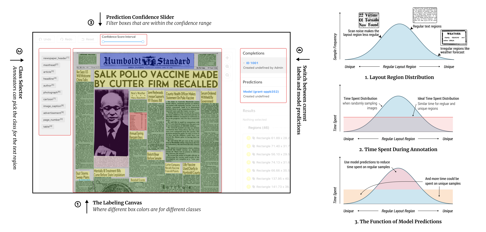

# Layout Parser Annotation Service



## Usage 

We package all the layout annotation service (the annotation interface and active learning modeling server) inside docker containers. The installation process is very straightforward and simple: 

1. Install Docker on your computer, following the [official instructions](https://www.docker.com/get-started).
2. Clone this repository to your computer. 
    ```bash
    git clone git@github.com:Layout-Parser/annotation-service.git
    cd annotation-service
    ```
3. Configure the annotation folders (see details in the section below) and start the docker container
    ```bash
    DATA=./data CONFIG=labeling-config.xml MODEL=model.py docker-compose up --build -d
    ```
4. Go to [localhost:8080](localhost:8080) and start annotating. 
5. Export the completed annotations via Label-Studio's [export function](http://localhost:8080/export), or you can find the annotation folder directly at [`labeled`](./labeled). 

## Configuration

In the 3rd command, the environmental variables `DATA`, `CONFIG`, and `MODEL` are used to set the labeling data directory, Label Studio configuration file, and ML backend model file, respectively. 

- `DATA` is for the folder containing all the images for labeling. By default, `DATA=./data`. 
- `CONFIG` is the configuration file for initializing the label-studio interface. The default value is `CONFIG=horizontal-layout.xml`, and you could find more examples in [`labeling/configs`](./labeling/configs).
- `MODEL` is for the script that generates the model prediction. The default value is `MODEL=model.py`.

## TODO 

- [ ] Enable the Active Learning Detectron2 model backend.